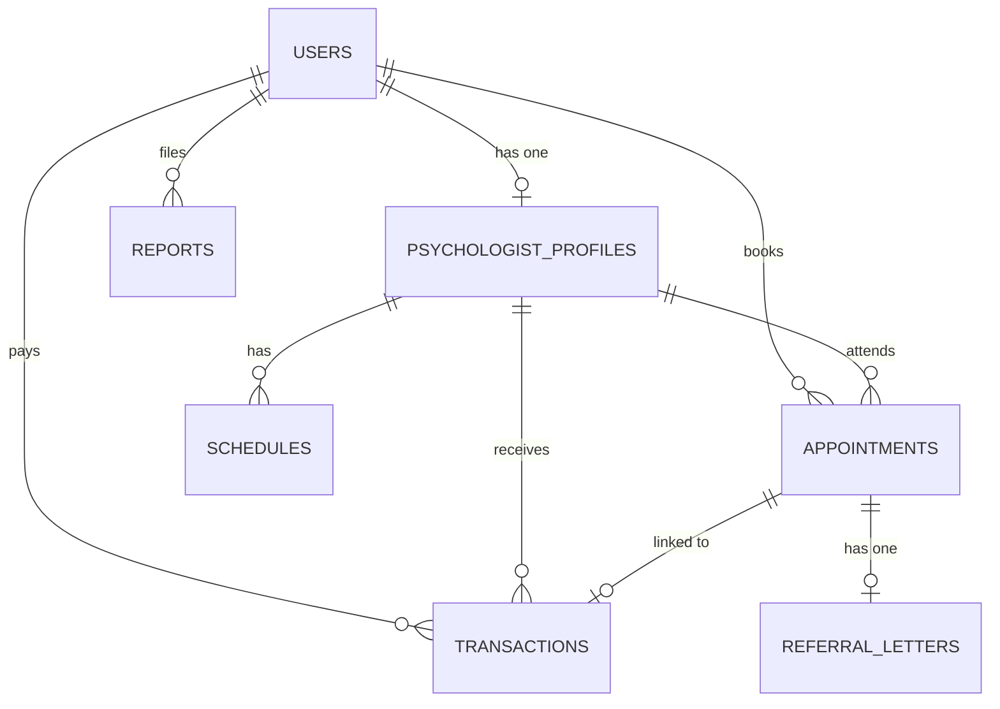

# 🩺 Psikologku

Psikologku adalah sebuah platform konsultasi psikologi online modern yang menghubungkan pasien (pengguna umum) dengan psikolog profesional. Sistem ini dirancang untuk memudahkan pencarian psikolog, penjadwalan konsultasi, pembayaran sesi secara aman, serta pengelolaan rekam medis psikologis (rekam medis konseling) dan surat rujukan.

---

## 🛠️ Tech Stack & Ekosistem

Aplikasi ini dibangun menggunakan arsitektur modern berkinerja tinggi yang menggabungkan backend Laravel dengan frontend Single-Page Application (SPA) berbasis React yang terkoneksi langsung via Inertia.js.

### Backend (PHP 8.4 & Laravel 13)
*   **Laravel Framework (v13.x):** Sebagai fondasi backend utama.
*   **Laravel Fortify:** Otentikasi *headless* (Registrasi, Login, Profile Edit, 2FA/TOTP).
*   **Laravel Socialite:** Integrasi Google Sign-In (OAuth) untuk akses praktis.
*   **Filament PHP (v5.x):** Panel administrasi admin dan back-office yang tangguh.
*   **Spatie Laravel Permission & Filament Shield:** Kontrol hak akses berbasis peran (RBAC) untuk `admin`, `psychologist`, dan `user`.
*   **Laravel Wayfinder:** Menghasilkan routing dan actions TypeScript otomatis untuk frontend.
*   **Midtrans PHP SDK:** Integrasi gerbang pembayaran (payment gateway) Snap Token & webhook callback.

### Frontend (React 19 & Inertia.js v3)
*   **React 19:** Library antarmuka komponen deklaratif berkinerja tinggi.
*   **Inertia.js (v3.x - React adapter):** Penghubung erat backend Laravel dengan frontend React SPA tanpa perlu membuat REST API terpisah.
*   **Tailwind CSS (v4.0):** Framework utility-first CSS generasi terbaru berbasis `@tailwindcss/vite`.
*   **Radix UI & Lucide React:** Komponen UI primitif ramah aksesibilitas dan pustaka ikon.
*   **TypeScript:** Type-safety penuh di sisi frontend.

### Infrastruktur & Storage
*   **Database:** PostgreSQL (atau MySQL) sebagai penyimpanan data relasional.
*   **Cloud Storage:** Supabase Storage (bucket `avatars`) untuk mengunggah dan menyimpan berkas digital (avatar profil, tanda tangan psikolog, bukti pengaduan CS).

---

## 🚀 Fitur Utama

- **Otentikasi & Keamanan:** Login/Registrasi, Google OAuth, verifikasi profil, serta Keamanan 2FA (Google Authenticator).
- **Verifikasi Psikolog:** Proses pengisian profil profesional (STR, SIPP, SIPPK, tanda tangan digital) oleh psikolog yang diverifikasi oleh Admin.
- **Booking & Pembayaran:** Pencarian psikolog, pemilihan jadwal ketersediaan, serta pembayaran online terintegrasi Midtrans Snap.
- **Konsultasi & Chat Real-Time:** Ruang obrolan langsung (chat room) yang terintegrasi untuk sesi konseling.
- **Rekam Medis & Rujukan:** Pengisian rekam medis terstruktur oleh psikolog, pembuatan surat rujukan, serta unduh PDF rekam medis & rujukan.
- **Layanan Pengaduan & Ulasan:** Sistem rating/review untuk sesi konsultasi dan Customer Service (CS) untuk pengaduan masalah langsung ke admin.

---

## 🏗️ Skema Basis Data (ERD)



---

## ⚙️ Persyaratan Sistem

Pastikan sistem lokal Anda telah menginstal komponen berikut:
*   **PHP:** v8.4+
*   **Node.js:** v18+ & NPM
*   **Composer**
*   **Database:** PostgreSQL atau MySQL
*   **Akun Supabase & Midtrans Sandbox** (untuk setup environment variable)

---

## 💾 Panduan Instalasi & Setup

Ikuti langkah-langkah di bawah untuk menjalankan proyek di lingkungan lokal Anda:

### 1. Clone Repositori
```bash
git clone https://github.com/username/psikologku.git
cd psikologku
```

### 2. Konfigurasi Environment (`.env`)
Salin file `.env.example` menjadi `.env`:
```bash
cp .env.example .env
```
Sesuaikan konfigurasi koneksi database, kredensial Google Client, Supabase API, serta Server/Client Key Midtrans Anda di file `.env`.

### 3. Setup Projek & Dependensi
Kami menyediakan *script* otomatis untuk mempermudah proses setup awal (instalasi library, migrasi database, dan build awal):
```bash
composer run setup
```
*Script ini otomatis menjalankan: `composer install`, pembuatan `.env`, `key:generate`, `migrate`, `npm install`, dan `npm run build`.*

### 4. Setup Shield Permissions (Opsional)
Jalankan perintah berikut untuk menginisialisasi role dan permission Filament Shield:
```bash
php artisan shield:install
```

### 5. Jalankan Server Development
Anda dapat menyalakan server backend, watcher queue, dan Vite bundler secara bersamaan hanya dengan satu perintah:
```bash
composer run dev
```
Perintah ini akan menjalankan:
- **Laravel Server** di `http://127.0.0.1:8000`
- **Vite Dev Server** (HMR React)
- **Queue Listener** untuk notifikasi & transaksi di latar belakang

---

## 🧪 Pengujian & Kode Linting

### Menjalankan Pengujian (Pest PHP)
Proyek ini memiliki cakupan pengujian unit dan fitur yang ditulis dengan Pest PHP. Jalankan perintah berikut untuk mengeksekusi test:
```bash
composer run test
```

### Menjalankan Pint Code Formatter (PHP)
Gunakan Laravel Pint untuk menjaga kerapian kode PHP sesuai dengan standar kode proyek:
```bash
composer run lint
```

### Menjalankan ESLint & Prettier (JS/TS)
Untuk memeriksa dan merapikan file JS, TS, dan React:
```bash
# Cek & merapikan struktur file js/ts
npm run lint

# Merapikan styling dengan Prettier
npm run format
```

---

## 📂 Struktur Direktori Utama

- `app/Filament/` - Konfigurasi panel administrasi Filament PHP (v5).
- `app/Http/Controllers/` - Kontroler backend untuk pembayaran, rekam medis, rujukan, jadwal, dll.
- `app/Models/` - Model Eloquent untuk representasi database.
- `app/Services/` - Integrasi API eksternal (seperti MidtransSnap).
- `resources/js/pages/` - Halaman frontend React 19 menggunakan adapter Inertia.js.
- `resources/js/components/` - Komponen UI modular (Radix UI + Lucide).
- `resources/js/layouts/` - Tata letak halaman global (`AppLayout` & custom).
- `routes/` - Pengalamatan rute backend Laravel (`web.php`, `settings.php`).
- `tests/` - Berkas pengujian berbasis fitur & unit (Pest).
